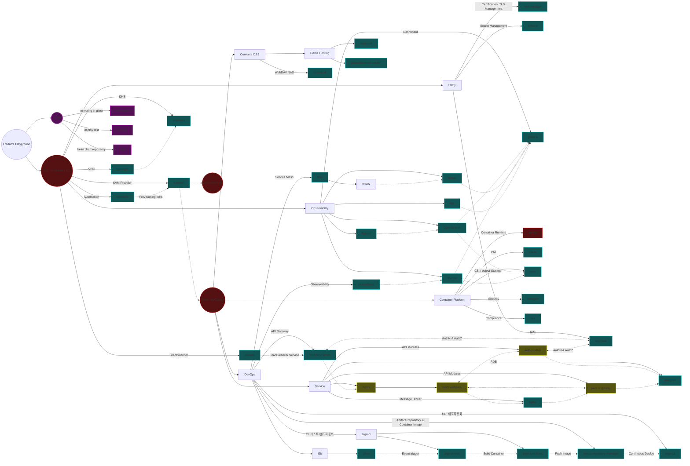
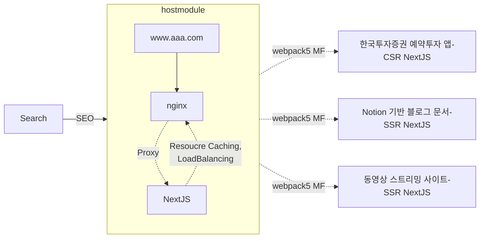

# the Fredric: k3s infra & service Playground

playgrounds fredric is a collection of k3s-based service infrastructure IAC for private testing of my personal projects.

## Architecture
### total Infra

### Micro-frontend for SEO


## Installation

```bash
#todo
```

## Usage

```bash
#todo
```
