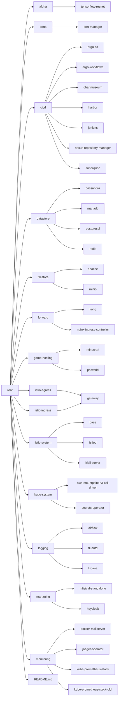

### Overview

```mermaid
graph LR;
    root
    root --> alpha
    root --> certs
    root --> cicd
    root --> datastore
    root --> filestore
    root --> forward
    root --> game-hosting
    root --> istio-egress
    root --> istio-ingress
    root --> istio-system
    root --> kube-system
    root --> logging
    root --> managing
    root --> monitoring
    root --> README.md

    alpha --> tensorflow-resnet

    certs --> cert-manager

    cicd --> argo-cd
    cicd --> argo-workflows
    cicd --> chartmuseum
    cicd --> harbor
    cicd --> jenkins
    cicd --> nexus-repository-manager
    cicd --> sonarqube

    datastore --> cassandra
    datastore --> mariadb
    datastore --> postgresql
    datastore --> redis

    filestore --> apache
    filestore --> minio

    forward --> kong
    forward --> nginx-ingress-controller

    game-hosting --> minecraft
    game-hosting --> palworld

    istio-egress --> gateway

    istio-ingress --> gateway

    istio-system --> base
    istio-system --> istiod
    istio-system --> kiali-server

    kube-system --> aws-mountpoint-s3-csi-driver
    kube-system --> secrets-operator

    logging --> airflow
    logging --> fluentd
    logging --> kibana

    managing --> infisical-standalone
    managing --> keycloak

    monitoring --> docker-mailserver
    monitoring --> jaeger-operator
    monitoring --> kube-prometheus-stack
    monitoring --> kube-prometheus-stack-old
```
